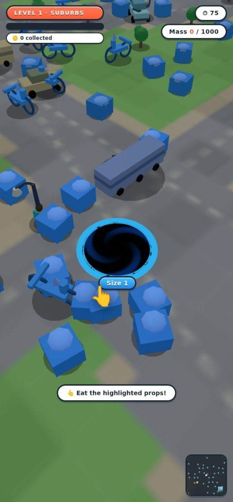

# 0003 — Hole feel & visual fidelity: investigation findings

**Date:** 2026-07-27  **Status:** investigation complete, no gameplay code changed.

Two complaints drove this investigation, both against the Hole.io reference
set now stored in `assets/references/holeio/`:

1. *"the motion of the hole is really odd and gets aggressive fighting against
   turning right and left and feels more like rolling a ball around as opposed
   to pushing an expanding hole along the planar surface."*
2. *"I want the game to look exactly like this — nice clean designs, accurate
   placement of buildings and objects, cars, street lamps and such."*

Both turned out to be measurable, not matters of taste. Everything below is
reproducible from two new scripts that need no GPU and no browser:

```
node scripts/motion-probe.mjs       # §1 — steering feel
node scripts/placement-audit.mjs    # §2 — object placement
```

Headline: **the motion complaint is one bug, not a tuning problem** — a
closed feedback loop between the camera and the avatar, plus an unnormalised
angle difference. **The visual complaint is five separate gaps**, none of
which is a Three.js limitation and none of which is blocked by performance.

---

## 1. Motion — the hole does not fight you, the camera does

### 1.1 What the code does

Per frame `src/main.js:1432-1439` runs this chain:

| step | code | effect |
|---|---|---|
| 1 | `camera.js:223` `get yaw() { return avatar.object3D.rotation.y + orbitYaw }` | camera yaw **is** the avatar's heading |
| 2 | `input.js:527` `moveVector(cameraYaw)` | screen intent is rotated **by that yaw** into world space |
| 3 | `avatar.js:338` `facingAngle = Math.atan2(nx, nz)` | heading is set from the world direction just produced |
| 4 | `avatar.js:354` `rotation.y += (facingAngle - rotation.y) * min(1, dt*6)` | heading damps toward it, feeding step 1 again |

Camera yaw is a function of avatar heading, and avatar heading is a function
of camera yaw. That is a closed loop with gain, and **any input with a lateral
component excites it.** Pure forward (W) is the one fixed point, which is
exactly why the complaint names left and right.

### 1.2 What it measures (`scripts/motion-probe.mjs`)

Three seconds of one held key from a standing start at spawn size. A straight
run covers 1020u.

| held input | distance | straightness | camera rotated | direction reversals |
|---|---|---|---|---|
| forward (W) | 1001u | 98.2% | 0° | 0 |
| **right (D)** | 976u | 95.7% | **2394°** | **85** |
| **left (A)** | 976u | 95.7% | **2394°** | **85** |
| **fwd+right (WD)** | 917u | 89.9% | **1323°** | **38** |

Holding one key for three seconds spins the camera **six and a half full
turns** and reverses its direction **85 times — 28 reversals per second.**
That is the "aggressive fighting" in numbers.

### 1.3 Two distinct defects stacked

**(a) The feedback loop → you carve a circle instead of strafing.** Holding D
makes the target heading permanently `cameraYaw - 90°`, so the damp term never
converges and yaw slews at a constant **-9.00°/frame = -540°/s**. You are not
strafing right; you are driving in a circle at 1.5 revolutions per second
while the world spins under you. That is precisely the "rolling a ball around"
sensation — a ball's contact frame rotates as it rolls, and this reproduces
that rotation for the camera.

**(b) The angle wrap → a hard snap the wrong way, forever.** `Math.atan2`
returns `(-π, π]`, but `rotation.y` is unbounded and `facingAngle - rotation.y`
at `avatar.js:354` is **never normalised to (-π, π]**. Frame-by-frame from the
probe:

```
f 9  camYaw   -81.0°  facingTarget  -171.0°  step   -9.00°
f10  camYaw   -90.0°  facingTarget  -180.0°  step   -9.00°
f11  camYaw   -99.0°  facingTarget   171.0°  step  +27.00°   <-- wrap
f12  camYaw   -72.0°  facingTarget  -162.0°  step   -9.00°
```

At the wrap the difference evaluates to **+270° instead of -9°**, so the
camera snaps 27° *against* the way you are steering. It then locks into a
**period-4 limit cycle** (-72° → -81° → -90° → -99° → snap) running at
**15 Hz** for as long as the key is held. This is the judder, and it is a
separate bug from (a) — fixing the loop alone would leave a latent wrap bug
in any code that damps toward an `atan2` result.

### 1.4 Why the reference doesn't have this

All ten reference screenshots show the **same fixed isometric yaw**: the road
grid runs at an identical diagonal in `1000030511.jpg` (Size 1) and
`1000030503.jpg` (Size 16), regardless of where the hole is or which way it
last moved. Hole.io's camera **never yaws to your heading.** That is what lets
it use camera-relative input without a fight — with a fixed camera, camera-
relative *is* world-relative, and the loop in §1.1 cannot close.

The probe simulates that hypothesis with everything else identical:

| held input | distance | straightness | camera rotated | reversals |
|---|---|---|---|---|
| forward (W) | 1001u | 98.2% | 0° | 0 |
| right (D) | 1001u | 98.2% | 90° | 0 |
| left (A) | 1001u | 98.2% | 90° | 0 |
| fwd+right (WD) | 1001u | 98.2% | 45° | 0 |

Every direction becomes a straight 1001u line, exactly 90° apart, with zero
reversals. **The oscillation disappears completely** — which confirms the root
cause is the coupling, not input smoothing (`ATTACK_RATE_PER_SEC`,
`RELEASE_RATE_PER_SEC`) and not the movement math in `avatar.update`.

### 1.5 Note on design intent

`game-design.md` §1 mandates camera-relative movement, citing the V1 complaint
"when the chase camera swings, your keys no longer match the screen" — and
then §2 specifies a chase camera that swings *with your heading*. Those two
clauses are individually reasonable and jointly unshippable. The doc even
records why V1 got away with it: *"V1 skipped it because the camera yaw was
nearly static."* V1's static yaw was load-bearing, and V2 removed it without
removing the dependency.

The candidate fix is therefore a **design decision, not just a patch**:
adopt the reference's fixed world yaw as the camera's base orientation and
keep `orbitYaw` as the only yaw the player controls. `game-design.md` §1/§2
must be amended in the same change (repo working agreement). The §1 acceptance
test — *"orbiting 180° then pressing W moves the avatar toward the screen
bottom"* — still passes, because it exercises manual orbit, which is
preserved.

Scope check: `avatar.object3D.rotation.y` is otherwise only used to aim dust
puffs (`avatar.js:409-411`); the funnel and rim are radially symmetric, so
decoupling the camera from it has no other visual consequence.

---

## 2. Placement — measurably wrong, not approximately right

`scripts/placement-audit.mjs` reads the pure-data district descriptor across
levels 1–20 (organic ×6, grid ×5, radial ×9):

| check | result | expected |
|---|---|---|
| vehicles pointing **down** their road | **0 / 1740 (0.0%)** | ~100% |
| vehicles lying **across** their road | **1740 / 1740 (100.0%)** | 0% |
| buildings standing **in the roadway** | **262 / 1020 (25.7%)** | 0% |
| street lamps standing **in the roadway** | **283 / 620 (45.6%)** | 0% |


*Top-down plan of level 1 from the generated descriptor. Grey = streets,
green = parks, purple = buildings, red = cars, orange = buses, blue = lamps.
Every vehicle is drawn at its true footprint and heading.*

### 2.1 Every vehicle in the game is sideways (100%)

A 90° convention mismatch between two modules that are each internally
consistent:

- `propkit.js:229-230` — vehicle meshes are built with **length along local
  +Z** (`car { w: 2.0, d: 4.2 }`, `bus { w: 2.6, d: 9.0 }`).
- `districts.js` header — *"Streets always carry their LENGTH in w (long axis
  = local X)."*
- `districts.js:309` — `roadSites()` hands each vehicle `rotY: st.rotY`.

So the car's long axis is aligned to the street's **short** axis. Positions
and lane offsets are correct (`lz = lane * st.d * 0.22` is properly across the
road); only the heading is 90° out. The one-line correction is
`rotY: st.rotY + Math.PI / 2`.

It gets worse in motion. `main.js:1480-1483` drives traffic along
`(cos(st.rotY), -sin(st.rotY))` — the street's long axis, which is *correct*.
Combined with the wrong mesh heading, **moving traffic crabs broadside down
the road.** Confirming the fix in one place repairs both parked and moving
vehicles.

### 2.2 A quarter of buildings stand in the road

`buildingSites()` (`districts.js:320-347`) insets a fixed **26 units** from the
block edge and never checks the resulting footprint against the street rects.
Two things defeat the constant: buildings are placed at their *centre* while
`building-large` is 15 units wide and scaled up by `radius / footprint`, and
the `organic` and `radial` archetypes emit rotated and diagonal streets that a
fixed axis-aligned inset cannot anticipate. The plan above shows buildings
sitting squarely on carriageways and at intersections.

### 2.3 Lamps are randomly rotated and half of them are in traffic

`districts.js:614` assigns street props `rotY: rngStreet() * Math.PI * 2` —
**fully random**. The lamp mesh has a curved arm (`streetlamp { w: 1.4, d: 0.6 }`,
built to overhang), so a random yaw points roughly half the arms into building
facades. Lamps also draw from the same undifferentiated `sidewalks` pool as
trash, bikes and pedestrians, so they land at random offsets instead of a
regular kerbside pitch. The reference (`1000030515.jpg`, `1000030513.jpg`)
shows lamps at a constant spacing along the kerb, all arms leaning over the
carriageway.

### 2.4 Blocks are dotted with detached cubes, not built out

Structurally the zoning is sound — `districts.js` already routes trash/bikes to
sidewalks, vehicles to roads, buildings to blocks, and dense clusters to parks,
exactly as `art-direction.md` §1 specifies. The failure is *density and form*:
`buildingSites()` yields at most **4 corners + 4 edge midpoints per block**, so
each block gets a handful of isolated free-standing boxes with large empty
voids between them (clearly visible in the plan). The reference builds blocks
out as a **continuous perimeter of row buildings, shoulder to shoulder, facades
flush to the sidewalk, with the block interior hidden.** That perimeter is the
single biggest reason the reference reads as a city and the current build reads
as objects on a plane — the same diagnosis `art-direction.md` opens with (D1),
still unresolved for buildings specifically.

---

## 3. Camera framing — the camera is ~3.5× too close

| | reference (`1000030511.jpg`, Size 1) | current build, Size 1 |
|---|---|---|
| hole width as fraction of frame | **~23%** | **~85%** |

Current values (`camera.js:25-33`): `PITCH_DEFAULT = 40°`, `FOV_DEFAULT = 70`,
`DIST_RADIUS_MULT = 4.0`. At spawn (r=26) that is a 104u eye distance; at a
portrait aspect of 0.466 the visible horizontal extent is only ~68u against a
52u hole.




*Left: shipping framing — the hole swallows the frame and almost no city is
visible. Right: a throwaway experiment (pitch 52°, FOV 34, dist 11r, fixed
yaw; **reverted, not committed**) showing the same scene, same assets, from
the reference's vantage.*

The right-hand image is the important one: with only camera constants changed,
the district suddenly reads as a place. It also makes the remaining art gaps
unmissable, which §4 covers. Note the reference is much closer to a long-lens
/ near-orthographic look than to FOV 70 — the low FOV is what makes Hole.io's
city read flat and toy-like rather than fish-eyed.

This directly contradicts `game-design.md` §2's stated goal — *"hole.io shows
far more floor than avatar for a reason — the food is the game"* — which the
shipping constants invert. It is also the reason the 96px minimap exists; with
correct framing that crutch is largely redundant, and the reference replaces it
with off-screen edge triangles for rivals.

---

## 4. Art gaps — five concrete deltas, none of them library limitations

Runtime probe of level 1 (18 instanced meshes, 493 props, **25 draw calls,
205k triangles**):

### 4.1 Shadows are off; blob shadows read as grey puddles

`renderer.shadowMap.enabled === false`. Prop grounding comes from
`prop-blob-shadows`, a single 493-instance mesh of flat dark circles
(`instancing.js:72-76`). In play these render as large soft grey ellipses far
wider than the props they sit under, and the avatar's wake decals
(`avatar.js:233-248`, radius `r * 0.8`, opacity 0.28) add more grey blobs
behind the hole:


The reference has **crisp, tight, high-contrast contact shadows** hugging each
footprint, offset consistently with a single sun direction. Every building,
car, tree and lamp is grounded by one. This is the largest single contributor
to the reference's "clean 3D" read.

### 4.2 The edibility tint flattens the palette to one hue

`instancing.js:366` blends every **edible** prop 30% toward the metro accent
and multiplies by 1.15. Metro 1's accent is `#3fa9f5` (blue). At spawn nearly
everything visible is edible, so nearly everything turns blue. Probed instance
colours confirm it — trees, pedestrians, lamps and bikes all carry the
*identical* value `0.79, 0.91, 1.09` (note the >1.0 channel: the brighten
clips). The base colours are near-neutral grey multipliers, so the 30% blend
dominates rather than tinting.

`art-direction.md` §3 already anticipated this failure — *"a hard tint
flattened the whole scene to one hue"* — and judged 30% soft enough. Against
near-grey bases it is not. The reference signals edibility with **no recolour
at all**: objects keep their true colours and size relative to the rim is the
only cue, backed by a "🔒 Too big" popup.

### 4.3 Buildings have no facades

`textures.js:30` — `CITY_TEXTURES_ENABLED = false`, and the runtime probe
confirms `map: false` on all three building instanced meshes. This is a
*deliberate, documented* state: the Leonardo photoreal set clashed with the
flat art direction and was parked in `assets/textures/photoreal/` pending a
flat-cartoon regen.

The important conclusion is that **regenerating textures is the wrong fix.**
The reference does not use photo facades either — its buildings are *geometry
and flat colour*: per-floor window bands, awnings over shopfronts, cornices,
roof plant, a distinct roof colour, a ground-floor entrance. Compare
`1000030499.jpg` (a pink five-storey walk-up with modelled window surrounds
and a striped awning) against `buildBuilding()` (`propkit.js:373-444`), which
produces a box, up to three thin window-band boxes, one door and an optional
setback plus antenna. The gap is modelled detail, not texture resolution.

### 4.4 Smooth shading on low-poly geometry

Probe: `flatShading: false` on every prop material. The reference is
unmistakably **flat-shaded low-poly** — crisp facets, hard value steps between
faces. Smooth-shading a 6-face box washes the silhouette out. This is a
one-property change with no geometry cost.

### 4.5 Palette and atmosphere are desaturated

Reference ground is saturated pastel — lavender-grey carriageways, cream
sidewalks, vivid green parks — under a bright cyan sky, with heavy value
separation between road/kerb/plaza/grass. The current build sits in
desaturated blue-grey (§4.2 compounds this), and distance fog
(`main.js:474-476`, near `0.18 × world`, far `0.95 × world`) washes mid-
distance geometry toward the sky colour well inside the play area. The
reference has **no visible distance fog**; the whole district stays crisp to
the horizon.

### 4.6 There is ample GPU headroom

25 draw calls and 205k triangles is a very light frame. **None of the gaps
above is a performance trade-off** — the flat look is not buying anything.
Shadow maps, flat shading, and several times the current geometric detail all
fit comfortably in the budget `tech-architecture.md` §1 sets.

---

## 5. On "there are plenty of capable 3D libraries"

Worth answering directly: **the library is not the problem, and switching
would cost a lot for nothing.**

The project is on **Three.js r185**, which is the mainstream choice for exactly
this kind of stylised low-poly browser game and is fully capable of the
reference look. Everything in §4 is achievable with the renderer already in
place — shadow maps, flat shading, instancing, vertex colours and a saturated
palette are all core Three.js features, and the frame budget (§4.6) is barely
touched. Nothing in the reference needs a feature Three.js lacks.

For completeness, the realistic alternatives and why none of them helps here:

- **Babylon.js / PlayCanvas** — comparable capability, both heavier, and each
  would mean rewriting `src/engine/*` wholesale. They solve none of §1–§4.
- **react-three-fiber / Threlte** — ergonomic wrappers *around Three.js*. Same
  renderer, plus a framework and a build step.
- **Post-processing (`EffectComposer`, SSAO, outlines)** — would help the
  "clean" read, but lives in `three/examples/jsm`, which `AGENTS.md` forbids
  and which is not vendored. Achievable only by vendoring those modules
  explicitly, which is a decision to make deliberately.

Two hard project constraints shape any recommendation (`AGENTS.md`): **no new
npm dependencies**, and **only `assets/vendor/three.module.js` + `three.core.js`
— no `three/examples/jsm` imports.** That already rules out `GLTFLoader` (hence
the existing `scripts/glb-to-js.js` offline conversion), `OrbitControls` and
the post-processing stack.

Where outside help *would* genuinely pay off is **art assets, not code**. The
existing Blender pipeline (`scripts/blender/build_props.py` → `.glb` →
`glb-to-js.js` → `modelkit.js`) is the right shape and already ships four
authored props (car, tree, person, lamp); the shortfall is that buildings never
went through it and are still primitive bakes (§4.3). Widely used CC0 low-poly
city kits — Kenney's City Kit, Quaternius, Poly Pizza — are stylistically very
close to the reference and can be run through the *existing* pipeline with no
new runtime dependency and no licensing issue. That is the cheapest large step
toward "looks exactly like this."

---

## 6. Recommended order of work

Ordered by player-felt impact per unit of risk. Nothing here has been
implemented; §1 and §3 touch camera/input and are gated by
`lessons-from-v1.md` B2/B4/B7.

| # | change | files | why first |
|---|---|---|---|
| 1 | Fix camera↔facing feedback loop: fixed world yaw base, `orbitYaw` as the only player yaw. Amend `game-design.md` §1/§2 in the same change. | `camera.js`, `.wiki/game-design.md` | the entire motion complaint; §1.4 shows it goes to zero |
| 2 | Normalise the angle difference in the facing damp to (-π, π] | `avatar.js:354` | latent wrap bug; independently correct |
| 3 | Vehicle heading `rotY: st.rotY + Math.PI/2` | `districts.js:309` | one line, fixes 100% of vehicles, parked and moving |
| 4 | Reference framing: raise pitch, drop FOV, raise `DIST_RADIUS_MULT` | `camera.js:25-33` | the city becomes visible at all |
| 5 | Reject building/lamp sites overlapping street rects; give lamps a kerb-relative yaw and regular pitch | `districts.js` | removes 262 buildings and 283 lamps from the road |
| 6 | Enable shadow maps; shrink/darken blob shadows; cut wake decals | `scene.js`, `instancing.js`, `avatar.js` | largest single "clean 3D" gain (§4.1) |
| 7 | Replace the 30% accent edibility tint with a non-recolouring cue |  `instancing.js:366` | restores the palette (§4.2) |
| 8 | Flat shading + saturated pastel palette + pull fog back | `propkit.js`, `metros.js`, `main.js` | cheap, large read improvement |
| 9 | Build blocks out as continuous row-building perimeters | `districts.js` | the "city not scatter" gap (§2.4) |
| 10 | Author building meshes through the Blender pipeline (window bands, awnings, cornices, roof plant) | `scripts/blender/`, `propkit.js` | largest remaining fidelity gap; biggest effort |

Items 1–5 are small, surgical and cover both complaints' root causes. Items
6–10 are the art work.

## 7. Reproducing this

```
node scripts/motion-probe.mjs      # §1 tables and the frame trace
node scripts/placement-audit.mjs   # §2 table (exits non-zero while failing)
npm start                          # then node scripts/screenshot-city.cjs
```

`scripts/placement-audit.mjs` exits non-zero while any placement check fails,
so it can be wired into `npm test` as a regression gate once §2 is fixed.

Reference art: `assets/references/holeio/` (10 screenshots, the visual target).
Evidence for this document: `evidence/`.
